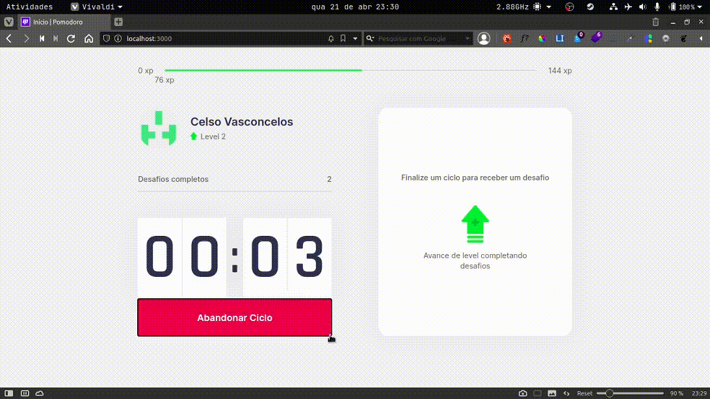
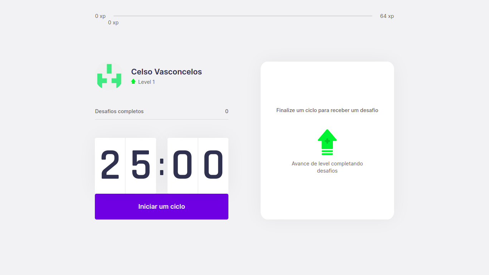
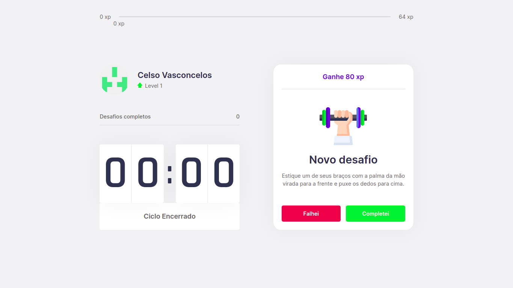

<h1> Um pouco sobre o projeto</h1>

    Pomodoro exercício, é uma webpage escrita em react que busca 
    trazer mais saúde para as pessoas que passam muito tempo na tela 
    do computador. Foi usado gamificação para ajudar a motivar as pessoas a usarem

    Para isso, ele se baseia na técnica de pomodoro 
    (que consiste em focar totalmente em uma tarefa por
    um curto tempo em seguida é realizado um intervalo )

<a href="https://pt.wikipedia.org/wiki/T%C3%A9cnica_pomodoro"> Clique aqui para saber mais!</a>

<h1>Demo</h1>

    Acima podemos ver o que acontece quando o tempo chega ao fim e 
    quando o usuário passa de nível. Você pode acessar a aplicação clicando  <a href="stop-now.vercel.app"> nesse link</a>

<h2> Telas complementares</h2>

    Essa é a tela inicial que o usuário irá ver quando acessar a aplicação

    A tela que o usuário irá ver quando o tempo acabar

